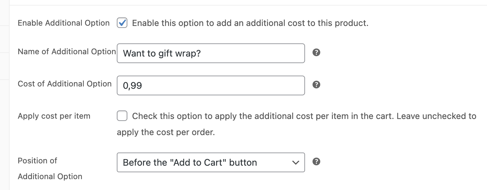
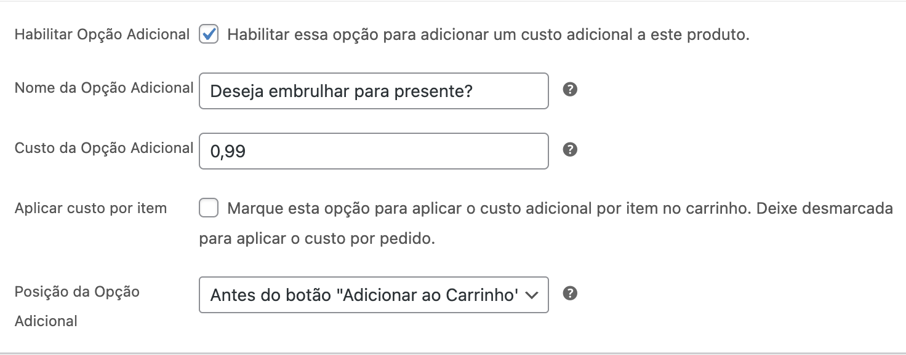

# WooCommerce Custom Fees

## English

**WooCommerce Custom Fees** is a plugin that adds customizable additional fees to WooCommerce products.

### Features
- Adds an additional cost option to WooCommerce products.
- Allows customization of where the fee appears on the product page.
- Supports different currencies and languages.

### Installation
1. Download the plugin or clone this repository.
2. Upload the `woocommerce-custom-fees` folder to the `/wp-content/plugins/` directory of your WordPress installation.
3. Activate the plugin through the 'Plugins' menu in WordPress.

### Usage
- Go to the product edit page and configure the additional fee in the product data section.
- The fees will be automatically applied in the shopping cart based on the settings.

### Contributions
Contributions are welcome! Feel free to fork this repository and submit a pull request.

## Português

**WooCommerce Custom Fees** é um plugin que adiciona taxas adicionais personalizáveis aos produtos do WooCommerce.

### Funcionalidades
- Adiciona uma opção de custo adicional aos produtos do WooCommerce.
- Permite personalizar a posição onde a taxa aparece na página do produto.
- Suporta diferentes moedas e idiomas.

### Instalação
1. Baixe o plugin ou clone este repositório.
2. Faça o upload da pasta `woocommerce-custom-fees` para o diretório `/wp-content/plugins/` da sua instalação WordPress.
3. Ative o plugin através do menu 'Plugins' no WordPress.

### Uso
- Acesse a página de edição do produto e configure a taxa adicional na seção de dados do produto.
- As taxas serão aplicadas automaticamente no carrinho de compras conforme configurado.

### Contribuições
Contribuições são bem-vindas! Sinta-se à vontade para fazer um fork deste repositório e enviar um pull request.
